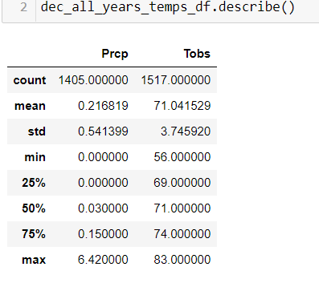
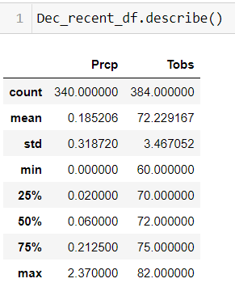

# surfs_up

**1.Overview of the statistical analysis:**

On my vacation to Oahu, I discovered my passion for surfing, I am calculating if I can establish a surf board & ice cream shop in Oahu. “Wavy” is my investor who asked for some data to see if we can get this business idea off the ground.

“Wavy” my investor gave me some data about the weather in 9 stations on the island, I did some analysis following are the results.

**2.Results:**

The data I have received have 2 tables Measurement and Station, The Measurement table contains of Date and temperature information’s and Station table contains Station id, longitude, latitude information’s.Earliest Date on the data '2010-01-01' and the latest date is ‘2017-08-23’, I have created data frames for the month of June and Dec.
Also created a list that shows station Id’s and count of data, I need decent amount of data to derive at any conclusions, I picked the top 3 stations who had most data points, and created an output to show minimum, maximum and average temperature in those stations 

1.USC00519281 = [(56.0, 87.0, 74.55)]

2.USC00519397 = [(56.0, 87.0, 74.55)]

3.USC00513117 = [(59.0, 85.0, 72.68)]

when looked at the data from 2015 to 2017 these station temprature data show:

1.USC00519281 = [(56.0, 85.0, 72.41)]

2.USC00519397 = [(58.0, 87.0, 74.90)]

3.USC00513117 = [(60.0, 85.0, 73.29)]

I have created a summary statistic for June and Dec for all data given, for June I have 1700 data points the minimum temperature is 64, Maximum is 85 and Average temperature is 74, 3rd quartile data shows 75% of days in june has 77-degree temperature. As for December I have 1517 data points with Min :56, Max:83 and Average temperature of 71, 3rd quartile data shows 75% of days in december has 74 degree F, This looks promising as well.

However, when I added the precipitation data things got trickier ,The probability of precipitation forecast is one of the most least understood elements of the any weather report. This does not mean there will be rain however this is one point to keep in mind that the chances are higher if precipitation number are higher . 

precipitation numbers are usually given in milimetre per hour,0.01 to 0.1mm precipitation is light rain, 0.1 to 0.3mm -moderate rain and anything greater that 0.3mm is considered heavy rain, This is important to keep in mind as "Wavy's" first investment closed due to rain.

In june_all_years_temps_df.describe()- 75% of days in June have 0.12 mm chance of rain that is moderate rain, dec_all_years_temps_df.describe()-75% of days have 0.15mm of rain moderate rain again, This is not good.

**3.Summary:**

I also made some recent statistical summary for June and Dec from year 2015 to 2017, considering climate change I wanted to see data in recent years. 

In June_recent_df.describe() - 75% of June days has 78 degree F , warmer weather good , but 75% of june days has 0.17 mm of precipitation rate

In Dec_recent_df.describe() -75 % of dec days has 75 degree F , also 75% od days in dec get 0.21 mm precipitation rate.

key differences in weather between June and December : June's Average temprature is 75 degree F ,precipitation numbers are lower than december , however December's Average temprature is 72 degree F ,however the precipitation rate is 0.21 higher than june, Min temprature is June is 64 Degree F , in December its 60 degree , dont see a big diffreence in minimum temprature.

If we just look at the temprature its looks like all year long we have more warmer days however when we take the precipitation rate into consideration , This business idea of surf and ice cream do not look very promising, unless I keep this business as a seasonal one. If the minimum temprature is between 60 to 64 the ocean water will feel much colder as well and chances surfers at the beach is low.

